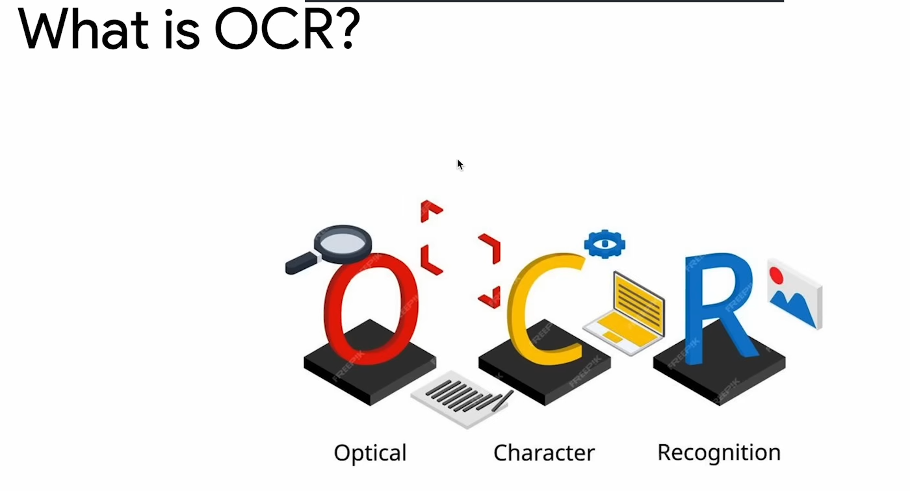
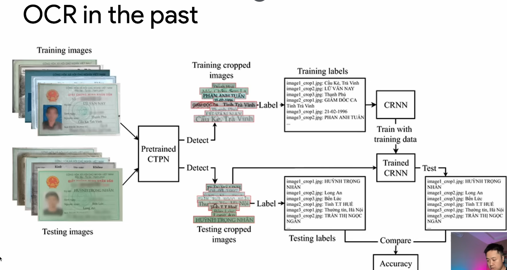
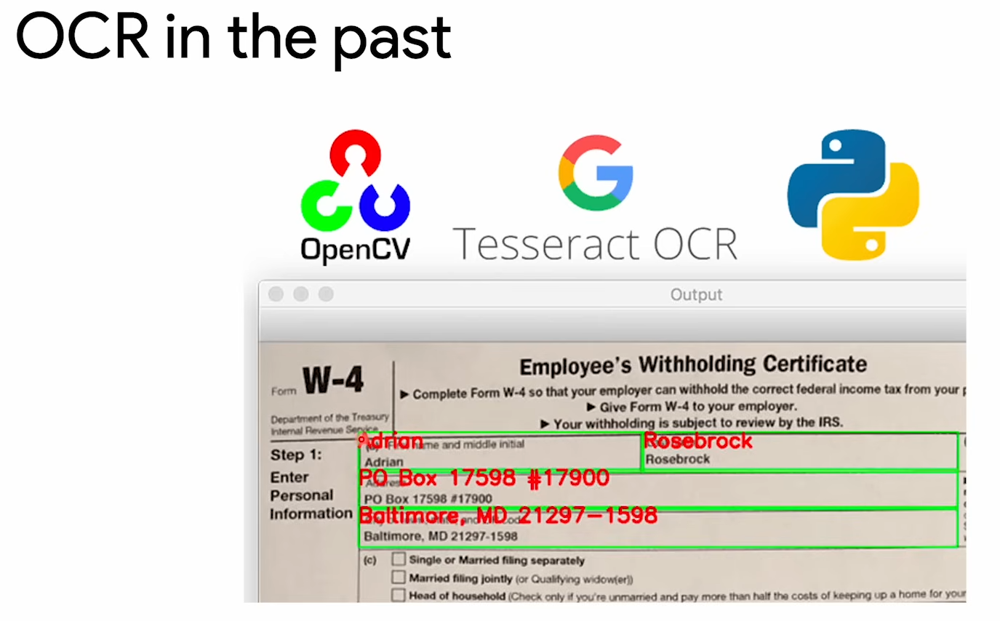
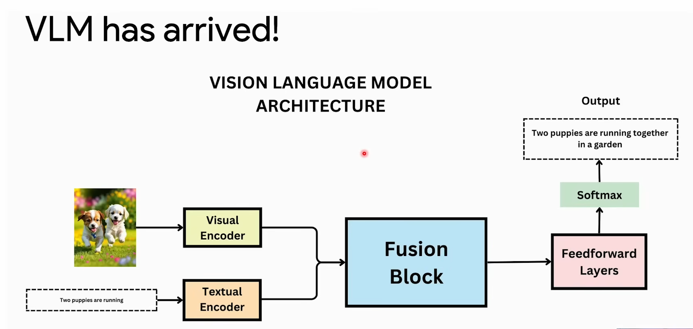
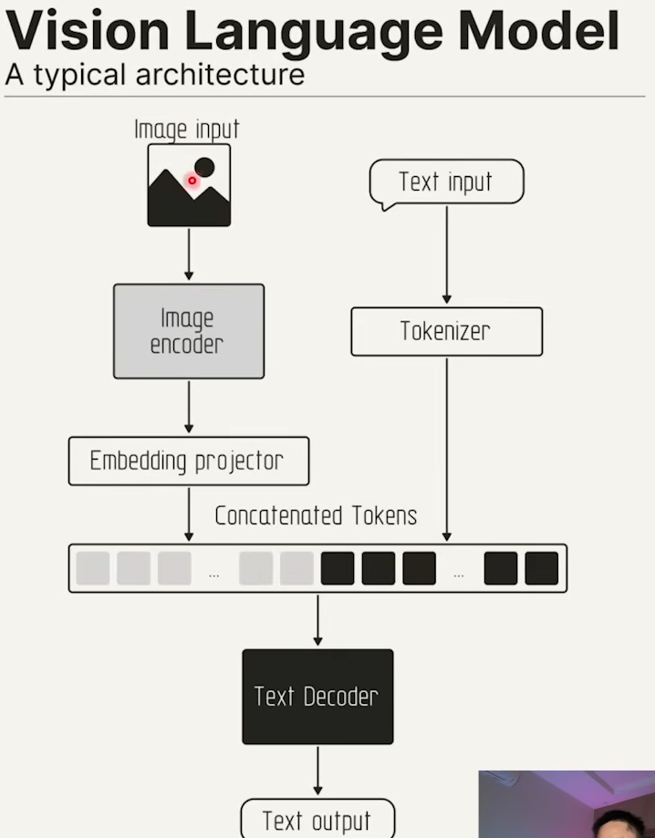

#OCR và VLM 

##Nhận diện ký tự quang học

##OCR trong quá khứ 

##Crop từng vùng ảnh rồi nhận diện -> rồi gán label lại 

##Vision Languagle Model -> Ví dụ như FastVLM của GG

##Ví dụ VLM có thể đưa prompt vào (ví dụ hãy trích xuất thông tin trong ảnh) . 
